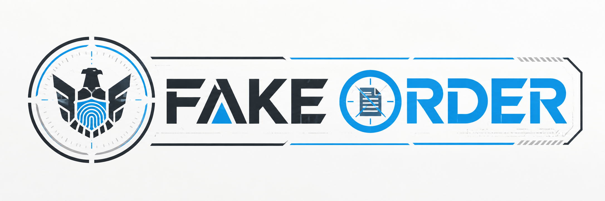

# Fake Order ロゴ仕様書



このファイルは、採用した「Fake Order」ロゴをもとにしたデザイン仕様を、コピーして利用できるJSON形式でまとめたものです。

## JSONデータ

```json
{
  "project": {
    "name": "Fake Order",
    "asset_type": "game_logo_system",
    "version": "1.0",
    "language": "ja",
    "design_theme": "明るい情報機関・監視・偽造命令・非対称情報戦"
  },
  "brand_concept": {
    "summary": "監視と命令書をモチーフに、正しい情報と偽情報が混在するゲーム性を表現する。",
    "keywords": [
      "監視",
      "偽造",
      "命令",
      "照合",
      "疑念",
      "情報戦",
      "近未来",
      "非対称対戦"
    ],
    "tone": [
      "明るい",
      "清潔",
      "機密的",
      "戦略的",
      "テクノロジー",
      "過度に暗くしない"
    ]
  },
  "primary_logo": {
    "name": "horizontal_full_logo",
    "layout": "横長",
    "composition": [
      "左側に円形エンブレム",
      "中央から右側にFAKE ORDERのワードマーク",
      "外周に照準器・監視フレームを連想させるライン",
      "FAKEはダークスレート、ORDERはブルー",
      "Oの内部に取消線付き命令書アイコン"
    ],
    "symbol_meaning": {
      "eagle": "組織・監視・権威",
      "fingerprint": "個人識別・潜入・スパイ",
      "crosshair": "監視・照準・追跡",
      "document": "命令書・情報操作",
      "strikethrough": "改ざん・無効化・偽造命令",
      "split_colors": "真実と偽情報、攻撃側と守備側の非対称性"
    }
  },
  "color_palette": {
    "primary_blue": {
      "hex": "#1A73E8",
      "usage": "ORDER、照準線、指紋、重要な選択状態"
    },
    "cyan_accent": {
      "hex": "#26BEA6",
      "usage": "補助線、ハッキング、スパイ側UI"
    },
    "dark_slate": {
      "hex": "#27343B",
      "usage": "FAKE、通常文字、エンブレムの暗色部分"
    },
    "cool_gray": {
      "hex": "#DDE3E6",
      "usage": "背景パネル、境界線、非アクティブ要素"
    },
    "paper_white": {
      "hex": "#F4F3EE",
      "usage": "書類風背景、明るい施設のベース"
    },
    "pure_white": {
      "hex": "#FFFFFF",
      "usage": "ロゴ背景、余白、反転ロゴの文字色"
    },
    "alert_red": {
      "hex": "#D95757",
      "usage": "警報、腐敗情報、危険表示のみ"
    }
  },
  "logo_variants": [
    {
      "id": "logo_horizontal_full",
      "name": "横長フルロゴ",
      "aspect_ratio": "約3:1〜4:1",
      "elements": [
        "円形エンブレム",
        "FAKE ORDERワードマーク",
        "外周フレーム"
      ],
      "recommended_usage": [
        "タイトル画面",
        "Steamストア画像",
        "公式サイトのヘッダー",
        "ゲーム内メインメニュー",
        "動画のオープニング"
      ],
      "background": [
        "白",
        "ライトグレー"
      ]
    },
    {
      "id": "logo_horizontal_compact",
      "name": "横長コンパクトロゴ",
      "aspect_ratio": "約3:1",
      "elements": [
        "簡略化した円形エンブレム",
        "FAKE ORDERワードマーク"
      ],
      "recommended_usage": [
        "Webサイトのナビゲーション",
        "ゲーム内HUD",
        "配信画面",
        "小さめのバナー"
      ]
    },
    {
      "id": "logo_square_emblem",
      "name": "正方形エンブレム",
      "aspect_ratio": "1:1",
      "elements": [
        "円形照準フレーム",
        "鷲",
        "指紋",
        "最小限のブルーアクセント"
      ],
      "recommended_usage": [
        "アプリアイコン",
        "SNSプロフィール画像",
        "Discordサーバーアイコン",
        "Steamライブラリアイコン",
        "ゲーム内の組織章"
      ],
      "square_expression": {
        "safe_area": "外周から12〜15%の余白を確保",
        "small_size_rule": "64px以下では外側の細い目盛りを省略",
        "minimum_detail": [
          "鷲のシルエット",
          "中央の指紋",
          "円形の照準枠"
        ]
      }
    },
    {
      "id": "logo_square_flat",
      "name": "正方形フラットアイコン",
      "aspect_ratio": "1:1",
      "elements": [
        "簡略化した鷲",
        "中央の指紋",
        "背景色と前景色の2〜3色構成"
      ],
      "recommended_usage": [
        "16px〜128pxの小型アイコン",
        "タスクバー",
        "ショートカット",
        "ファビコン"
      ]
    },
    {
      "id": "logo_symbol_only",
      "name": "シンボル単体",
      "aspect_ratio": "1:1",
      "elements": [
        "鷲と指紋のみ"
      ],
      "recommended_usage": [
        "ゲーム内アイテム",
        "制服のワッペン",
        "端末の起動画面",
        "透かし",
        "実績アイコン"
      ]
    },
    {
      "id": "logo_wordmark_only",
      "name": "ワードマーク単体",
      "aspect_ratio": "横長",
      "elements": [
        "FAKE ORDER文字",
        "Aの三角形アクセント",
        "Oの命令書アイコン"
      ],
      "recommended_usage": [
        "細長いヘッダー",
        "クレジット画面",
        "動画字幕",
        "印刷物"
      ]
    },
    {
      "id": "logo_stacked",
      "name": "縦積みロゴ",
      "aspect_ratio": "4:5〜1:1",
      "elements": [
        "上部にエンブレム",
        "下部にFAKE",
        "最下部にORDER"
      ],
      "recommended_usage": [
        "ポスター",
        "縦長SNS画像",
        "イベントパネル",
        "パッケージ正面"
      ]
    },
    {
      "id": "logo_monochrome",
      "name": "モノクロロゴ",
      "aspect_ratio": "各レイアウトに対応",
      "elements": [
        "黒1色または白1色"
      ],
      "recommended_usage": [
        "白黒印刷",
        "レーザー刻印",
        "小型スタンプ",
        "単色UI"
      ]
    },
    {
      "id": "logo_inverted",
      "name": "ダーク背景用反転ロゴ",
      "aspect_ratio": "各レイアウトに対応",
      "elements": [
        "白いワードマーク",
        "ブルーのアクセント",
        "簡略化したエンブレム"
      ],
      "recommended_usage": [
        "監視画面",
        "暗いゲームUI",
        "映像演出",
        "黒背景のグッズ"
      ]
    }
  ],
  "typography": {
    "style": "太く横幅のある近未来サンセリフ",
    "visual_rules": [
      "直線と鋭い切り欠きを使用",
      "Aの内部を三角形アクセントにする",
      "Eの中央線をブルーの情報バーとして扱う",
      "Oを円形監視装置または命令書アイコンとして表現",
      "文字間は詰めすぎず、機械的なリズムを保つ"
    ],
    "supporting_fonts": {
      "japanese_ui": [
        "Noto Sans JP",
        "BIZ UDPゴシック",
        "IBM Plex Sans JP"
      ],
      "numbers_and_codes": [
        "IBM Plex Mono",
        "Roboto Mono",
        "Space Mono"
      ]
    }
  },
  "clear_space": {
    "definition": "ロゴの周囲に、エンブレム中央の指紋幅と同等以上の余白を確保する。",
    "minimum_margin": "ロゴ全高の10%以上",
    "square_icon_margin": "外周から12〜15%"
  },
  "minimum_size": {
    "horizontal_digital": "横幅240px以上",
    "horizontal_print": "横幅60mm以上",
    "square_digital": "32px以上",
    "square_detailed": "128px以上",
    "favicon": "16pxでは指紋または照準のみの超簡略版を使用"
  },
  "background_rules": {
    "preferred": [
      "#FFFFFF",
      "#F4F3EE",
      "#DDE3E6"
    ],
    "dark_mode": [
      "#11181D",
      "#27343B"
    ],
    "avoid": [
      "複雑な写真の上へ直接配置",
      "ブルーと近い色の背景",
      "低コントラストなグレー背景",
      "強いグラデーション背景"
    ]
  },
  "prohibited_usage": [
    "ロゴの縦横比を変形する",
    "指定外の色へ変更する",
    "鷲・指紋・命令書の位置関係を崩す",
    "外周フレームだけを不自然に太くする",
    "影や発光を過度に追加する",
    "ロゴの上に別の文字やアイコンを重ねる",
    "小さいサイズで細部をすべて残して潰す",
    "FAKEとORDERの色分けを逆転させる"
  ],
  "export_specifications": {
    "master_formats": [
      "SVG",
      "PDF",
      "AI"
    ],
    "raster_formats": [
      "PNG",
      "WebP"
    ],
    "transparent_background": true,
    "recommended_sizes": {
      "horizontal": [
        "3840x960",
        "1920x480",
        "1200x300"
      ],
      "square": [
        "2048x2048",
        "1024x1024",
        "512x512",
        "256x256"
      ],
      "icon": [
        "128x128",
        "64x64",
        "32x32",
        "16x16"
      ]
    },
    "color_modes": {
      "digital": "RGB",
      "print": "CMYK"
    }
  },
  "file_naming": {
    "pattern": "fake_order_{layout}_{color}_{background}_{size}.{extension}",
    "examples": [
      "fake_order_horizontal_fullcolor_light_1920x480.png",
      "fake_order_square_fullcolor_transparent_1024x1024.png",
      "fake_order_symbol_monochrome_dark.svg",
      "fake_order_wordmark_white_transparent.svg"
    ]
  },
  "recommended_asset_set": [
    "横長フルカラー・白背景",
    "横長フルカラー・透明背景",
    "横長反転・透明背景",
    "正方形フルカラー・白背景",
    "正方形フルカラー・ダーク背景",
    "正方形フラットアイコン",
    "シンボル単体",
    "ワードマーク単体",
    "モノクロ黒",
    "モノクロ白",
    "16px用ファビコン"
  ]
}
```

## 使用方法

- VS CodeでこのMarkdownファイルを開き、必要な項目をコピーして使用します。
- 実装用データとして使う場合は、コードブロック内だけをコピーして `.json` ファイルに保存できます。
- ロゴ画像を書き出す際は、`logo_variants`、`minimum_size`、`export_specifications` を基準にします。
- Unity内では、横長ロゴ・正方形アイコン・シンボル単体を用途ごとに分けて管理するのがおすすめです。
