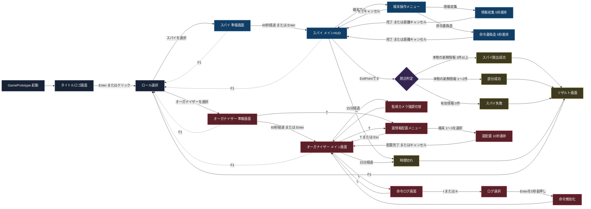

# Fake Order 画面遷移図

現在実装済みの画面と操作フローを基準にした遷移図です。

```mermaid
flowchart LR
    Start["GamePrototype 起動"] --> Title["タイトルロゴ画面"]
    Title -->|"Enter またはクリック"| Role["ロール選択"]
    Role -->|"スパイを選択"| SpyPrep["スパイ 準備画面"]
    Role -->|"オーガナイザーを選択"| OrgPrep["オーガナイザー 準備画面"]

    SpyPrep -->|"60秒経過 または Enter"| SpyMain["スパイ メインHUD"]
    OrgPrep -->|"60秒経過 または Enter"| OrgMain["オーガナイザー メイン画面"]

    SpyMain -->|"端末で E"| TerminalMenu["端末操作メニュー"]
    TerminalMenu -->|"情報収集"| InfoHack["情報収集 5秒進捗"]
    TerminalMenu -->|"命令書偽造"| ForgeHack["命令書偽造 5秒進捗"]
    TerminalMenu -->|"Eでキャンセル"| SpyMain
    InfoHack -->|"完了 または距離キャンセル"| SpyMain
    ForgeHack -->|"完了 または距離キャンセル"| SpyMain

    SpyMain -->|"ExitPointで E"| ExitJudge{"脱出判定"}
    ExitJudge -->|"本物の新鮮情報 3件以上"| SpyWin["スパイ脱出成功"]
    ExitJudge -->|"本物の新鮮情報 1～2件"| Partial["部分成功"]
    ExitJudge -->|"有効情報 0件"| SpyFail["スパイ失敗"]
    SpyWin --> Result["リザルト画面"]
    Partial --> Result
    SpyFail --> Result

    OrgPrep -->|"T"| TrapMenu["罠情報配置メニュー"]
    OrgMain -->|"T"| TrapMenu
    TrapMenu -->|"端末 1～3を選択"| TrapProgress["罠配置 10秒進捗"]
    TrapMenu -->|"T または Esc"| OrgMain
    TrapProgress -->|"配置完了 またはキャンセル"| OrgMain

    OrgMain -->|"L"| CommandLog["命令ログ画面"]
    CommandLog -->|"I または K"| CommandSelect["ログ選択"]
    CommandSelect -->|"Enterを5秒長押し"| Invalidate["命令無効化"]
    Invalidate --> OrgMain
    CommandLog -->|"L"| OrgMain

    OrgMain -->|"C"| CameraFocus["監視カメラ強調切替"]
    CameraFocus --> OrgMain

    SpyMain -->|"15分経過"| TimeUp["時間切れ"]
    OrgMain -->|"15分経過"| TimeUp
    TimeUp --> Result

    SpyPrep -.->|"F1"| Role
    OrgPrep -.->|"F1"| Role
    SpyMain -.->|"F1"| Role
    OrgMain -.->|"F1"| Role
    Result -->|"F1"| Role

    classDef common fill:#182235,stroke:#7f95b5,color:#ffffff
    classDef spy fill:#123e65,stroke:#4ea3df,color:#ffffff
    classDef organizer fill:#5b2028,stroke:#df6b78,color:#ffffff
    classDef modal fill:#33254f,stroke:#a987e6,color:#ffffff
    classDef result fill:#3d3a20,stroke:#d6c45c,color:#ffffff
    class Start,Title,Role common
    class SpyPrep,SpyMain,TerminalMenu,InfoHack,ForgeHack spy
    class OrgPrep,OrgMain,TrapMenu,TrapProgress,CommandLog,CommandSelect,Invalidate,CameraFocus organizer
    class ExitJudge modal
    class SpyWin,Partial,SpyFail,TimeUp,Result result
```

## 色分け

- 青：スパイ側画面
- 赤：オーガナイザー側画面
- 紫：判定・分岐
- 黄：試合結果
- 紺：共通画面
